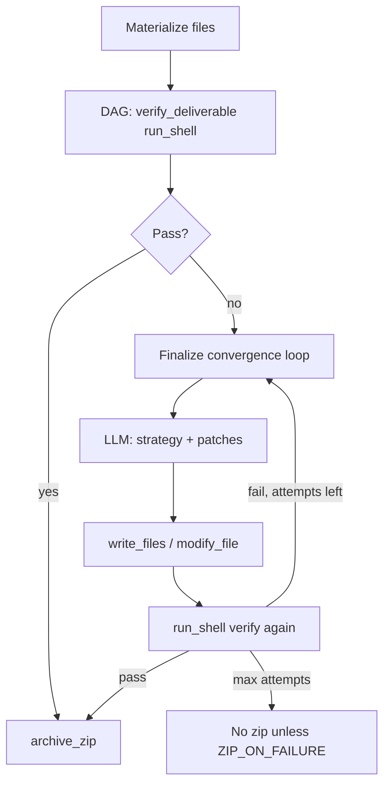

# Deliverable convergence (verify → learn → fix)

The notebook `OMEGA_CLEANED_FINAL.ipynb` described a **TruthConvergenceEngine** sketch. That behavior is implemented in the Python agent as:

**Module:** `omega_agent/reflection/deliverable_convergence.py`  
**Orchestration:** `OmegaAgent._finalize_deliverables()` + SOTA retries

## Flow



## Compared to notebook cells

| Notebook concept | Python implementation |
|------------------|----------------------|
| `TruthConvergenceEngine.execute` | `DeliverableConvergenceEngine.converge()` |
| `verify_fn` deterministic check | `run_shell` + `infer_verify_command()` |
| Reflect & new strategy | `_learn_and_plan_fixes()` JSON |
| `execute_goal_with_sota_guarantee` | `_execute_with_sota_guarantee()` + `recovery_guidance` |

## Python-only code fix loop

Inline Python goals (no workspace files) still use `SOTAQualityGate.ensure_code_quality()` (`code_executor` + LLM fix), separate from npm deliverable verification.

## Using from notebook

```python
from omega_agent import OmegaAgent, Config

agent = OmegaAgent(Config())
result = await agent.run("Build a Vite React dashboard with tests")
print(result.metadata.get("deliverable_verify"))
```

Do not duplicate convergence logic in the notebook; call `OmegaAgent` or import `DeliverableConvergenceEngine` directly if you need a custom pipeline.
